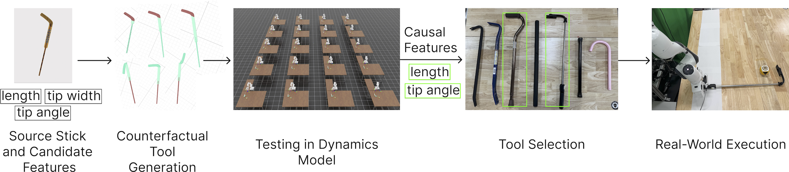

Consider a TV remote that falls under the sofa where you cannot reach directly. You might look for an object to help retrieve it. Intuitively, you can rule out a book for being too short, a crowbar for being too heavy, or a chair for being too large to fit under the gap. Instead, you might try a rolling pin or a selfie stick. But how do you know which object is suitable for the task? This judgment relies on understanding which physical properties, such as length, weight, or shape, are relevant for the task at hand, and whether a candidate object satisfies those properties. Humans can reason about this effortlessly using prior experience, commonsense knowledge, and an internal model of how physical interactions work.

<figure style="width: 100%; margin: auto; padding: 0">
    
</figure>

In this work, we show that a similar form of reasoning can be enabled in robots by combining commonsense priors from vision language models (VLMs) with counterfactual reasoning through simulation. We propose **ToolAnalogy**, a novel approach that discovers object properties that are causally related to task success by experimenting with counterfactual objects generated with a 3D semantic object editor, and uses these causal features to classify novel objects as substitutes to carry out the task.

---

Imagine the three scenarios below where the robot completes the task using a *tool*.
<figure style="display: flex; gap: 10px; flex-wrap: wrap; width: 100%; margin: auto; padding: 0">
    

        <video width="100%" autoplay loop muted style="flex: 1">
            <source src="images/hook.mp4" type="video/mp4">
            Your browser does not support the video tag.
        </video>
        <figcaption style="text-align: center">Hooking</figcaption>
    

    

        <video width="100%" autoplay loop muted style="flex: 1">
            <source src="images/reach.mp4" type="video/mp4">
            Your browser does not support the video tag.
        </video>
        <figcaption style="text-align: center">Reaching</figcaption>
    

    

        <video width="100%" autoplay loop muted style="flex: 1">
            <source src="images/scoop.mp4" type="video/mp4">
            Your browser does not support the video tag.
        </video>
        <figcaption style="text-align: center">Scooping</figcaption>
    

</figure>

What happens when you are in a new environment where the exact source tool is missing? What could you possibly use to hook something, or reach an object on high shelf, or scoop candies? The agent would pick objects based on their features if only it knew which of those features are causally relevant. However, the robot *must* conduct *interventional experiments* to figure out such causal features---experiments that answer questions such as "what happens if the hockey stick happened to be shorter?", "could I stepped on the platform if it was lighter?", or "would a spoon with a flat head work?"

We can now answer these questions using recent advances in computer vision and foundational models. Below are example semantic edits using Ganeshan et al. (2024).

<figure style="display: flex; gap: 10px; flex-wrap: wrap; width: 100%; margin: auto; padding: 0">
    

        <video width="100%" autoplay loop muted style="flex: 1">
            <source src="images/hockey-edit.mp4" type="video/mp4">
            Your browser does not support the video tag.
        </video>
    

    

        <video width="100%" autoplay loop muted style="flex: 1">
            <source src="images/box-edit.mp4" type="video/mp4">
            Your browser does not support the video tag.
        </video>
    

    

        <video width="100%" autoplay loop muted style="flex: 1">
            <source src="images/spoon-edit.mp4" type="video/mp4">
            Your browser does not support the video tag.
        </video>
    

</figure>

Once we have a dataset of *counterfactual* objects---objects that are the product of imagination---the robot can test in simulation which of those objects work to figure out the causal features and their boundaries.

<figure style="display: flex; gap: 10px; flex-wrap: wrap; width: 100%; margin: auto; padding: 0">
    

        <video width="100%" autoplay loop muted style="flex: 1">
            <source src="images/hook-sim.mp4" type="video/mp4">
            Your browser does not support the video tag.
        </video>
    

    

        <video width="100%" autoplay loop muted style="flex: 1">
            <source src="images/spot-sim.mp4" type="video/mp4">
            Your browser does not support the video tag.
        </video>
    

    

        <video width="100%" autoplay loop muted style="flex: 1">
            <source src="images/hook-sim.mp4" type="video/mp4">
            Your browser does not support the video tag.
        </video>
    

</figure>

And after that, the robot can recognize *novel* substitutes to complete the task.

<figure style="display: flex; gap: 10px; flex-wrap: wrap; width: 100%; margin: auto; padding: 0">
    

        <video width="100%" autoplay loop muted style="flex: 1">
            <source src="images/hook-novel.mp4" type="video/mp4">
            Your browser does not support the video tag.
        </video>
    

    

        <video width="100%" autoplay loop muted style="flex: 1">
            <source src="images/spot-novel.mp4" type="video/mp4">
            Your browser does not support the video tag.
        </video>
    

    

        <video width="100%" autoplay loop muted style="flex: 1">
            <source src="images/scoop-novel.mp4" type="video/mp4">
            Your browser does not support the video tag.
        </video>
    

</figure>

See the [the full video](images/video.mp4).